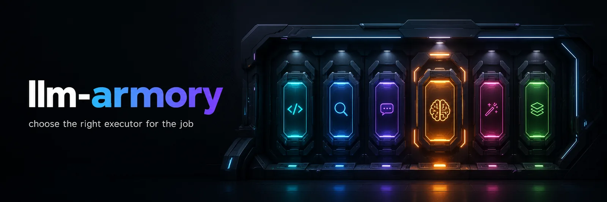

<p align="center">
  <picture>
    <source srcset="assets/armory-banner.avif" type="image/avif">
    <source srcset="assets/armory-banner.webp" type="image/webp">
    
  </picture>
</p>


# llm-armory

**llm-armory** — choose the right executor for the job.

The armory holds named **loadouts** (executor lanes) you can pull for different kinds of work.

Fable (Claude Code) acts as the advisor. When you need heavy lifting, you explicitly **arm** the session by choosing the right loadout from the armory — primarily **grok-xhigh** (SuperGrok Heavy at xhigh effort).

This is built for deliberate hybrid advisor + executor patterns from Claude CLI. Pure Grok sessions should use their native `spawn_subagent` tools instead.

## Usage

```bash
armory --list                     # list available loadouts
armory --dry-run grok-xhigh
armory quality                    # native Fable/Max advisor session (unarmed)
armory grok-xhigh -p "task brief" -w my-exec   # arm with Grok xhigh executor
```

The launcher lives at `bin/llm`.

### Setup: make `armory` the command

```bash
# Symlink for the short, branded command
mkdir -p ~/.local/bin
ln -sfn ~/Repositories/llm-armory/bin/llm ~/.local/bin/armory

# Ensure it's on PATH (add to your shell rc if needed)
export PATH="$HOME/.local/bin:$PATH"
```

After this you can run `armory` from anywhere.

Verify:
```bash
armory --list
armory --help
```

## Loadouts in the armory

| Loadout     | Backend                  | Use for |
|-------------|--------------------------|---------|
| quality     | Max / Fable (native)     | pure advisor / judgment sessions (equivalent to plain `claude`) |
| grok-xhigh  | SuperGrok Heavy (xhigh)  | **Primary loadout** — arm Fable advisor sessions with heavy Grok execution. `grok -p --effort xhigh` + worktrees + contract. Not for native Grok sessions. |
| balanced    | DeepSeek API             | (skipped for now) |
| glm         | z.ai API                 | (skipped for now) |
| free        | [freellmapi](https://github.com/tashfeenahmed/freellmapi) (self-hosted) | (skipped for now) |
| burn        | Anthropic API key        | limit-reset days, uncapped Opus |

**Current focus:** Fable as advisor + `armory grok-xhigh`. Legacy cheap dispatch is disabled; grok-xhigh is the ready heavy loadout.

## Skills

The armory ships an optional Claude Code **skill**.

### `fusion-advisor` — two-model advisor fusion

When a *decision* is high-leverage (a design fork, a risky change, a `/loop` course-correction), a single frontier model can be confidently wrong. `fusion-advisor` turns your advisor session (Claude Code / Opus) into a **two-model advisor**: it consults a second, different-vendor frontier model (Grok, via the `armory` launcher) as a context-isolated peer, reconciles the two positions by **verifying — not voting**, then delegates execution down to the armory's executor loadouts.

It is built on the research reality that naive multi-model mixing often *hurts* (quality dilution, echo-chamber convergence, self-preference bias) — so the skill is mostly **guardrails** that make fusion pay off only where it should. Manual-invoke only; reserved for high-leverage calls (it costs 2–10× tokens).

- Skill file: [`skills/fusion-advisor/SKILL.md`](skills/fusion-advisor/SKILL.md)
- Install: `ln -sfn "$PWD/skills/fusion-advisor" ~/.claude/skills/fusion-advisor`

## Executor contract

Every loadout pulled from the armory carries strong discipline:

- One commit per completed task (no batching)
- `PROGRESS.md` ledger written after each task (left untracked)
- Session ends with exactly one line: `RESULT: ok|partial|failed — commits: <n> — <summary>`

These rules are injected via `--rules` (Grok) or system prompt (other lanes).

## Conventions

- The advisor session (native Max/Fable) never sets `ANTHROPIC_BASE_URL`.
- Cross-CLI delegation: Fable (advisor) explicitly spawns `armory <loadout> -p "..."` children.
- Keys live in `presets/providers/*.env` (gitignored).

## Statusline

Show which loadout is currently armed:

```json
"statusLine": {
  "type": "command",
  "command": "~/Repositories/llm-armory/bin/llm-statusline"
}
```

## Notes

- Designed primarily for Claude Code CLI (Fable as advisor) to arm itself with Grok xhigh executors on explicit instruction.
- Grok-native sessions are unaffected — use `spawn_subagent` and native tools.
- The legacy "cheap LLM pool" dispatch remains disabled.

See `templates/armory-snippet.md` for a ready-to-paste block for your `CLAUDE.md` / `AGENTS.md`.

## Credits

The `free` loadout runs against **[freellmapi](https://github.com/tashfeenahmed/freellmapi)** — a self-hosted free-tier LLM API aggregator by [tashfeenahmed](https://github.com/tashfeenahmed) (this project is not affiliated with it). Self-host runbook: [`freellmapi/NOTES.md`](freellmapi/NOTES.md).
